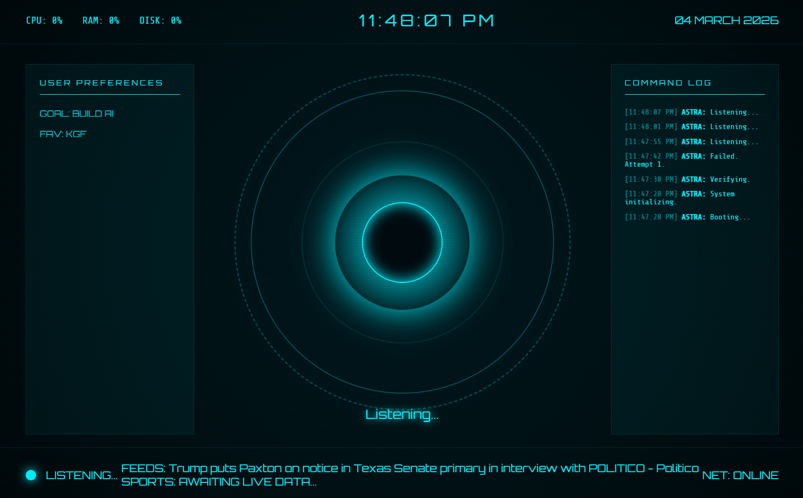

# ASTRA-OS 🚀

**ASTRA-OS** is a Jarvis-style desktop assistant built with **Electron** and **Python**. It features a futuristic UI, voice command capabilities, app automation, and a multi-layered security system including Face Unlock.

[🔗 **Live Demo (UI Only)**](https://astra-os-wheat.vercel.app/ui/index.html)



## ✨ Features

-   **🔐 Multi-Layer Security:**
    -   **Face Unlock:** Uses `DeepFace` and `Facenet` for biometric authentication.
    -   **Emergency Passphrase:** Voice-activated override if face recognition fails.
    -   **Emergency PIN:** Manual fallback for system access.
    -   **Intruder Capture:** Automatically snapshots and logs unauthorized access attempts.
-   **🎙️ Voice Assistant:**
    -   Speech-to-text powered by `SpeechRecognition` (Google API).
    -   Text-to-speech using Windows `SAPI.SpVoice`.
    -   Conversational AI integrated with **Ollama (Llama 3)** for offline/local intelligence.
-   **🎵 Entertainment & Productivity:**
    -   **Spotify Integration:** Search and play tracks via voice commands.
    -   **App Automation:** Open/Close applications (Chrome, Notepad, WhatsApp, etc.).
-   **📊 Live Dashboards:**
    -   **System Telemetry:** Real-time CPU, RAM, and Disk monitoring.
    -   **News Feed:** Live headlines from NewsAPI.
    -   **Cricket Scores:** Real-time match updates via CricAPI.

## 🛠️ Tech Stack

-   **Frontend:** Electron, HTML5, CSS3 (Futuristic UI), JavaScript.
-   **Backend:** Python 3.x.
-   **Libraries:**
    -   `DeepFace`, `OpenCV` (Computer Vision)
    -   `SpeechRecognition`, `pywin32` (Voice)
    -   `Spotipy` (Spotify API)
    -   `Requests`, `psutil` (Data & Telemetry)

## 🚀 Getting Started

### Prerequisites

1.  **Node.js & npm** (for Electron)
2.  **Python 3.10+**
3.  **Ollama** (Optional, for AI features - [Download here](https://ollama.com/))
    -   Run `ollama run llama3` to pull the model.

### Installation

1.  **Clone the repository:**
    ```bash
    git clone https://github.com/Darshan007-code/ASTRA-OS.git
    cd ASTRA-OS
    ```

2.  **Setup Python Virtual Environment:**
    ```bash
    python -m venv .venv
    .\.venv\Scripts\activate
    pip install -r python/requirements.txt
    ```
    *(Note: If `requirements.txt` is missing, manual install: `pip install opencv-python deepface tf-keras speechrecognition requests spotipy pywin32 psutil`)*

3.  **Install Node dependencies:**
    ```bash
    npm install
    ```

4.  **Configure API Keys:**
    To enable all features, you must add your own API keys in `python/astra.py`.
    -   **Spotify:** Get your `CLIENT_ID` and `CLIENT_SECRET` from the [Spotify Developer Dashboard](https://developer.spotify.com/dashboard). Set the Redirect URI to `http://127.0.0.1:8888/callback`.
    -   **News:** Get your key from [NewsAPI.org](https://newsapi.org/).
    -   **Cricket:** Get your key from [CricAPI.com](https://www.cricapi.com/).

    Open `python/astra.py` and replace the following placeholders:
    ```python
    SPOTIFY_CLIENT_ID = "YOUR_CLIENT_ID"
    SPOTIFY_CLIENT_SECRET = "YOUR_CLIENT_SECRET"
    NEWS_API_KEY = "YOUR_NEWS_API_KEY"
    CRICKET_API_KEY = "YOUR_CRICKET_API_KEY"
    ```

### Running the App

```bash
npm start
```

## 🛡️ Security Configuration

-   **Initial Setup:** Place your reference photo at `python/face_data/user.jpg` for Face Unlock to work.
-   **Default PIN:** `3849`
-   **Default Passphrase:** "darshan have a nice day"

## 📜 License

This project is licensed under the MIT License - see the `package.json` file for details.

---
*Built with ❤️ by Darshan*
